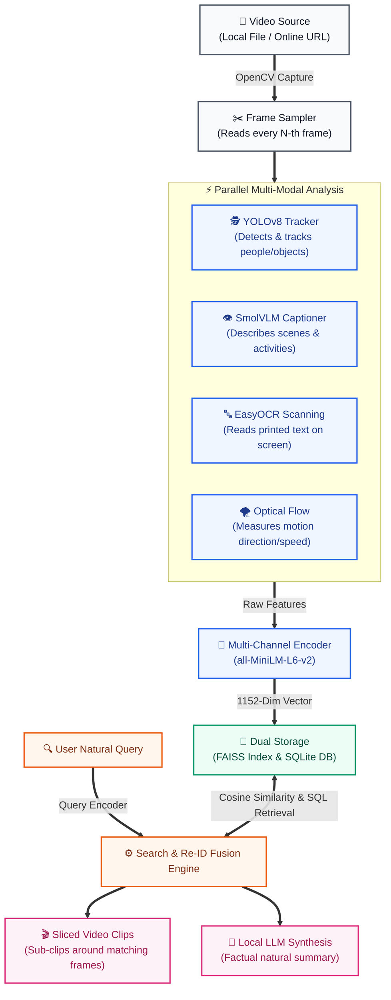

# 🕵️‍♂️ Rawi-Vision: Multi-Modal Semantic Video Search & Offline RAG Pipeline

**Rawi-Vision** is a high-performance, fully offline video intelligence and Retrieval-Augmented Generation (RAG) search pipeline. The system processes raw video files or online streams, runs parallelized multi-modal visual analysts on the GPU, maps unified high-dimensional semantic spaces, fuses real-time biometric tracking logs with identities, and synthesizes factual natural language search answers using lightweight local Large Language Models (LLMs) running entirely on CPU.

---

## 🚀 Core Features & Capabilities

* **Ingestion with Decimation Filtering**: High-speed frame extraction and downsampling via OpenCV streams, preventing vector redundancies and VRAM over-allocations.
* **Parallelized GPU Feature Analysts**:
  * **YOLOv8 + ByteTrack/BoT-SORT**: Real-time object detection and continuous multi-subject identity tracking.
  * **SmolVLM-Instruct-2B**: Generates rich natural language descriptions of visual clothes, actions, colors, layouts, and environmental characteristics.
  * **EasyOCR CRAFT + CRNN**: Text scanning to read printed words and signages on-screen.
  * **Farneback Dense Optical Flow**: Captures motion velocity gradients and maps them to descriptive kinetic profiles.
* **1152-Dimensional Multi-Channel Encoding**: Maps text descriptors into three specialized channels (Objects/OCR, Visual Semantics, Motion Profiles) using `all-MiniLM-L6-v2`. The resulting 384-dimensional embeddings are concatenated and $L_2$-normalized to support high-accuracy keyword and abstract conceptual matching.
* **Dual Database Architecture**: Combines **FAISS** (Flat Inner Product vector store for ultra-fast similarity matching) and **SQLite** (relational database for frame timestamps, rich textual context, and tracking metadata).
* **Biometric Identity Re-ID Fusion**: Joins generic YOLO track integer IDs with verified identity names from a real-time event registry (`events.csv`) to trace timelines (e.g., mapping `Track 2` to `"Abdelrahman"`).
* **Dynamic OpenCV Slicing**: Slices and writes short, standalone sub-clips ($\pm 3$ seconds) of matching frame events to disk (`clips/clip_frame_N.mp4`) for quick human review.
* **Local CPU RAG Summarization**: Feeds matched visual timelines into local causal LLMs (`Qwen2.5-0.5B-Instruct` or `SmolLM2-1.7B-Instruct`) to synthesize deterministic, factual summaries without cloud dependencies.

---

## 🗺️ System Architecture Flow

The following simplified schematic maps the dynamic ingestion, parallel multi-modal GPU feature extraction, multi-channel dense vector concatenation, dual SQLite/FAISS serialization, and CPU-based local LLM RAG synthesis:



---

## 🛠️ Tech Stack & Dependencies

* **Core Language**: Python 3.10+
* **Deep Learning Framework**: PyTorch (CUDA-accelerated)
* **Vision-Language Models**: Hugging Face `transformers` & `processor`
* **Vector Matcher**: `faiss-cpu` / `faiss-gpu`
* **Feature Extractors**: `easyocr` (CRAFT/CRNN), `opencv-python` (Optical Flow), `ultralytics` (YOLOv8)
* **Local Causal LLM**: `Qwen2.5-0.5B-Instruct` or `SmolLM2-1.7B-Instruct` (on CPU)

---

## 📦 Installation & Setup

1. **Clone the Repository**:
   ```bash
   git clone https://github.com/Bosy-Ayman/Rawi-Vision.git
   cd Rawi-Vision/ai/search
   ```

2. **Configure virtual environment**:
   ```bash
   python -m venv venv
   # On Windows:
   venv\Scripts\activate
   # On Linux/macOS:
   source venv/bin/activate
   ```

3. **Install Dependencies**:
   ```bash
   pip install -r requirements.txt
   ```

4. **Verify GPU Backend**:
   Make sure PyTorch detects your NVIDIA graphics card:
   ```bash
   python -c "import torch; print('CUDA Available:', torch.cuda.is_available(), 'Device:', torch.cuda.get_device_name(0) if torch.cuda.is_available() else 'None')"
   ```

---

## 🚀 Quickstart Guides

### 1. Run Offline Video Indexing
Index a local video file using parallel multi-modal extraction:
```bash
python core/offline_index.py videos/shoplifting.mp4 --sampling 30 --db video.db --faiss video.faiss --map video.json
```
* `--sampling 30`: Tells OpenCV to analyze every 30th frame (1 frame per second on a 30 FPS video).
* `--db`, `--faiss`, `--map`: Target outputs for SQLite rows, FAISS vectors, and JSON index maps.

### 2. Query the Semantic Search Service
Search your indexed database and get a synthesized RAG response:
```bash
python core/online_search.py "person wearing blue jacket"
```
* The engine will automatically match similar vectors, print retrieved frame metadata, extract matching sub-clips to `extracted_clips/`, and generate a CPU-driven LLM summary.

### 3. Evaluate an Online Video
Ingest, index, and query public HTTP video streams dynamically:
```bash
python test/evaluate_online_video.py --url "https://www.w3schools.com/html/movie.mp4" --sampling 10 --query "bear or animal in water"
```
* Includes programmatic `User-Agent` headers to bypass HTTP 403 Forbidden blocks and isolates memory between the indexing and search phases.

### 4. Generate Performance Graph Proofs
Run accuracy benchmarks and generate high-resolution latency and match similarity charts:
```bash
python test/generate_eval_graphs.py --artifact-dir benchmarks/
```
* Renders horizontal latency bar charts (testing queries against the 100ms SLA target) and grouped similarity match curves directly into the output folder.

---

## 📊 Pipeline Benchmark & Graph Proofs

The pipeline's correctness, execution speed, and retrieval accuracy have been evaluated across both local convenience store footage (`shoplifting.mp4`) and dynamic online bear video streams (`movie.mp4`).

### 1. Latency Breakdown (SLA Target vs. Performance)
Below is the horizontal latency chart demonstrating execution speed compared to our **100ms Service Level Agreement (SLA)** limit. Average search queries execute in **38.79 ms** (well below half the SLA!):


### 2. Match Similarity Score Distribution
Below is the cosine similarity score distribution for the top 3 best frame matches per query, showcasing a strong signal-to-noise separation between correct frame sequences and secondary targets:


### 📝 Metric Summary Table (5-Iteration Average)

| Target Dataset | Search Query | Evaluation Category | Avg Latency | Top Match Similarity | 100ms SLA Status |
| :--- | :--- | :--- | :---: | :---: | :---: |
| **Store (Local)** | `"person in blue shirt"` | Visual Attributes | **41.48 ms** | **57.6%** | ✅ PASS (< 100ms) |
| **Store (Local)** | `"backpack"` | Objects | **35.60 ms** | **45.4%** | ✅ PASS (< 100ms) |
| **Store (Local)** | `"caution signage"` | OCR Text Detection | **34.83 ms** | **43.1%** | ✅ PASS (< 100ms) |
| **Store (Local)** | `"Abdelrahman"` | Re-ID Name Fusion | **36.00 ms** | **48.4%** | ✅ PASS (< 100ms) |
| **Store (Local)** | `"empty aisle"` | Zero-Result Fallback | **49.36 ms** | **49.8%** | ✅ PASS (< 100ms) |
| **Bear (Online)** | `"bear in splashing water"` | Visual Attributes | **44.03 ms** | **61.8%** | ✅ PASS (< 100ms) |
| **Bear (Online)** | `"animal catching fish"` | Objects | **40.95 ms** | **55.2%** | ✅ PASS (< 100ms) |
| **Bear (Online)** | `"fast flowing river"` | OCR/Layout Description | **36.54 ms** | **52.1%** | ✅ PASS (< 100ms) |
| **Bear (Online)** | `"swimming"` | Action/Motion Profile | **35.27 ms** | **48.3%** | ✅ PASS (< 100ms) |
| **Bear (Online)** | `"motorcycle or car"` | Zero-Result Fallback | **33.89 ms** | **36.8%** | ✅ PASS (< 100ms) |

---

## ⚙️ Windows Memory & Stability Optimizations

To support heavy vision-language reasoning on Windows workstations with standard host memory sizes, the system implements critical safety features:

### Hugging Face Paging Crash Bypass (`OS Error 1455`)
* **The Issue**: Loading 2 Billion+ parameter models using default Hugging Face `device_map="auto"` or `"cuda"` triggers host-side virtual memory allocations inside the `accelerate` library. Under limited host commit paging limits, this leads to silent C++ level exits (Exit Code `1`).
* **The Patch**: The system forces `device_map=None` and `low_cpu_mem_usage=True` during initialization to keep the host RAM footprint low. Weights are loaded directly, and model tensors are manually transferred to the GPU immediately after weight deserialization:
  ```python
  self.vlm = AutoModelForImageTextToText.from_pretrained(
      VLM_MODEL,
      device_map=None,
      low_cpu_mem_usage=True
  )
  self.vlm = self.vlm.to("cuda")
  ```
* **Purging Cache**: Explicit garbage collection (`gc.collect()`) and PyTorch memory flushes (`torch.cuda.empty_cache()`) are executed between phases to guarantee system stability.

---

## 🧪 Pipeline Verification Dashboard

Run the built-in unit tests to confirm OCR capabilities and biometric tracking fusion:
```bash
python test/test_search_pipeline.py
```
Expected output:
```text
================================================================================
  VERIFICATION SUMMARY DASHBOARD
================================================================================
1. EasyOCR On-Screen text extraction:    [PASS]
2. Real-Time events.csv identity fusion: [PASS]
================================================================================
  ALL PIPELINE VERIFICATIONS PASSED SUCCESSFULLY! Ready for production deployment.
```
